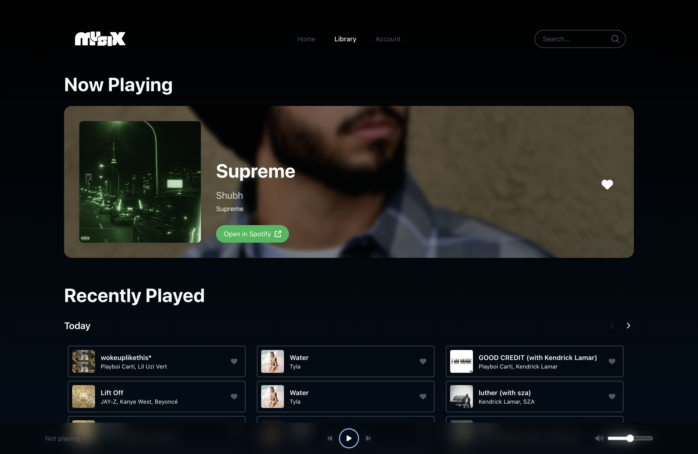
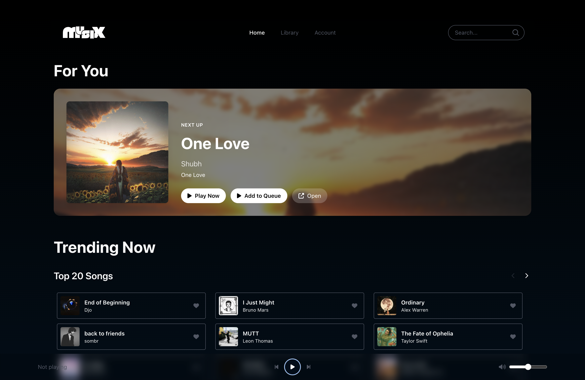

# 🎵 Musix
[](https://musix-now.vercel.app/)
[](https://react.dev/)
[](https://vitejs.dev/)
[](https://nodejs.org/)
[](https://developer.spotify.com/)
[](LICENSE)

<p align="center">
  
</p>


### Features
- Spotify login with PKCE and Premium-aware web player
- AI Recommendations from the currently playing track
- Library: top tracks/artists, saved albums, and recently played
- Deezer charts for trending songs, artists, albums, and playlists
- Search, artist, album, and song detail pages
- Serverless Deezer proxy for production on Vercel
- AI recommendations with context-aware ranking based on your listening history, audio features, and real-time playback signals
- Hybrid recommender pipeline that blends Spotify seeds with ML scoring for more diverse and relevant picks

## Local Development

### 1) Frontend
```
cd frontend
npm install
npm run dev
```

Frontend dev server: `http://127.0.0.1:5174` (or 5173 if available).

### 2) Backend
```
cd backend
npm install
npm run dev
```

Backend runs on `http://localhost:8080`.

## Environment Variables

Create `frontend/.env.local`:
```
VITE_SPOTIFY_CLIENT_ID=your_spotify_client_id
VITE_SPOTIFY_LOCAL_REDIRECT_URI=http://127.0.0.1:5174/callback
VITE_SPOTIFY_REDIRECT_URI=https://your-domain/callback
VITE_BACKEND_URL=http://localhost:8080
 
# Optional
VITE_ENABLE_AZURE_ML_RECS=false
VITE_AZURE_ML_RECS_LIMIT=20
```

## 💻 Tech Stack

### Frontend
| Technology | Purpose |
|-----------|---------|
| **React 19** | UI framework |
| **Vite** | Build tool & dev server |
| **React Router** | Client-side routing |
| **Tailwind CSS** | Styling & responsive design |
| **FontAwesome** | Icons |
| **Axios** | HTTP client |

### Backend
| Technology | Purpose |
|-----------|---------|
| **Node.js** | Runtime environment |
| **Express.js** | Web framework |
| **CORS** | Cross-origin requests |
| **dotenv** | Environment variables |

### Third-party APIs
| API | Purpose |
|-----|---------|
| **Spotify Web API** | Primary music data, user authentication, library management, playback control |
| **Deezer API** | Fallback music data source, trending content, genre browsing |
| **YouTube Data API** | Alternative authentication, video content integration |
| **Genius API** | Lyrics search and song information |
| **Azure Key Vault** | Secure token storage for server-side operations |
| **Azure ML** | AI-powered music recommendations (optional) |

### Service Files
| File | Purpose |
|------|---------|
| `spotifyServices.js` | Spotify API wrapper with caching and rate limiting |
| `spotifyAuthService.js` | OAuth PKCE flow and token management |
| `deezerServices.js` | Deezer API wrapper with fallback support |
| `youtubeService.js` | Google OAuth and YouTube integration |
| `geniusService.js` | Genius lyrics and song info |
| `genreService.js` | Genre mapping and categorization |
| `azureMlService.js` | Azure ML recommendations client |

Create `backend/.env`:
```
PORT=8080
FRONTEND_ORIGIN=http://127.0.0.1:5174
```

> Spotify Web Playback SDK requires a Premium account.

## Backend API

- `GET /api/health` → health check
- `GET /api/me` → Spotify profile (requires `Authorization: Bearer <token>`)
- `GET /api/recommendations` → recommendation payload based on top tracks
  - Query: `limit`, `time_range` (`short_term` | `medium_term` | `long_term`)

## AI Recommendations

Musix ships with a hybrid recommendation pipeline that fuses Spotify signals with an ML ranking layer. The system:
- Seeds candidates from the currently playing track, top artists, and track audio features
- Scores candidates using a learned model that adapts to your listening history
- Filters repeats, balances familiarity vs discovery, and keeps sessions fresh
- Continuously improves in the background as your taste shifts

## Deployment Notes (Vercel)

The frontend includes a serverless Deezer proxy at:
```
/api/deezer?url=https://api.deezer.com/...
```
This avoids CORS issues in production.

## Project Structure
```
backend/   # Express API for recommendations and profile proxy
frontend/  # React app (Spotify, Deezer, UI)
```

## Screenshots

<p align="center">
  
  
</p>

## 🤝 Contributing

Contributions are welcome! Please follow these steps:

1. **Fork** the repository
2. **Create** a feature branch: \`git checkout -b feature/amazing-feature\`
3. **Commit** changes: \`git commit -m 'Add amazing feature'\`
4. **Push** to branch: \`git push origin feature/amazing-feature\`
5. **Open** a Pull Request

## 📝 License

This project is licensed under the **MIT License** - see [LICENSE](LICENSE) file for details.

## 🙏 Acknowledgments

- **Spotify** for the amazing Music API
- **React** community for fantastic resources
- **Tailwind CSS** for beautiful styling
- **Vite** for blazing-fast builds

## 📞 Support

- 🐛 Report bugs via [GitHub Issues](https://github.com/lilswapnil/musix/issues)
- 💬 Ask questions in Discussions
- 🔗 Contact: [GitHub](https://github.com/lilswapnil)

---

<div align="center">
  <strong>Made with ❤️ by Scott</strong>
  <br/>
  <sub>Happy Discovering! 🎧</sub>
</div>